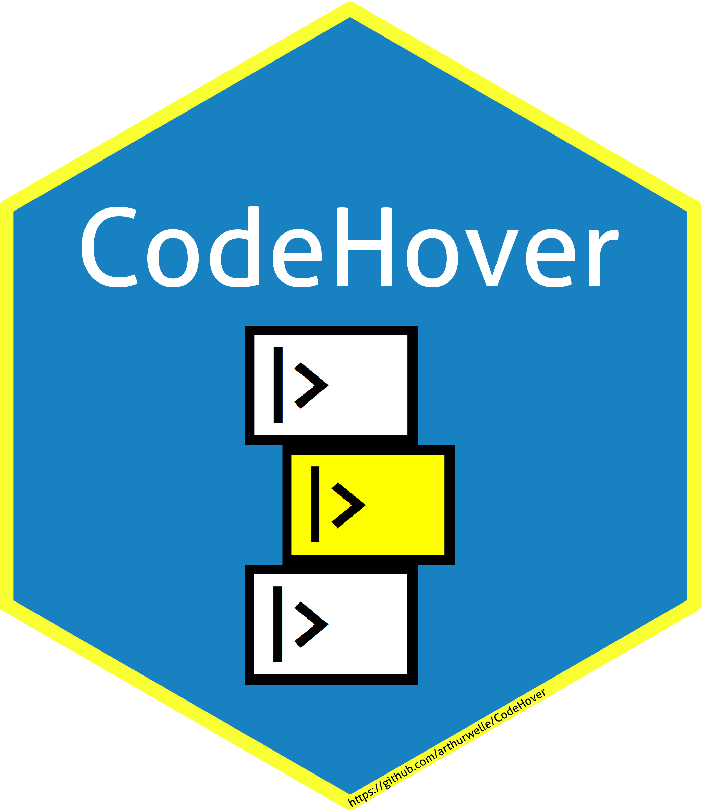
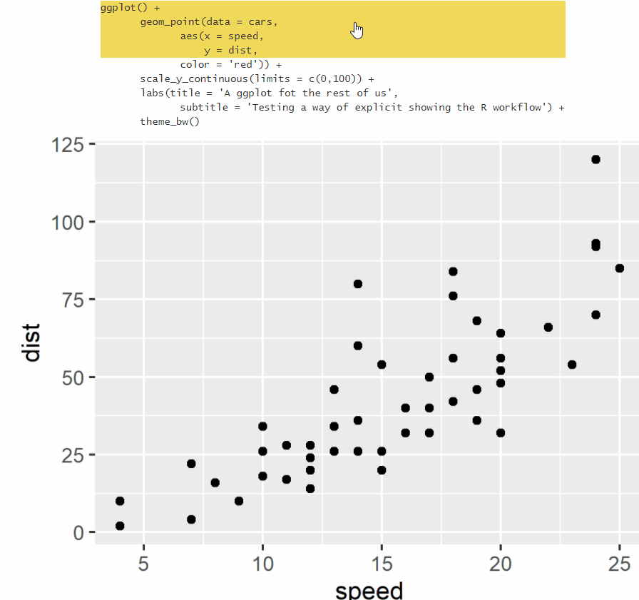

# codehover 

<!-- badges: start -->
<!-- badges: end -->

Pipes are an excellent way to code. They make it easy to follow the code chain of transformations and their results. 

The codehover aims to make it easy to create a HTML table with a simple hover effect (JavaScript/JQuery + CSS) that shows images just bellow the said table. 

This way one could set up pseudo-lines of code (show as text) in the table and a series of images showing the intermediate results of the code with a hovering interaction. 

The package use is educational, a fast way of showing code actions. 

I have to say that I begin with the ideia of the package without knowing about a simillar package based on <a href= "https://github.com/yihui/xaringan">Xaringan</a>: <a href= "https://github.com/EvaMaeRey/flipbookr">flipbookr</a>. In fact, I guess it was in my subconscious all along, for I follow Gina Reynolds work on <a href= "https://twitter.com/EvaMaeRey">Twitter</a> for a long time. She made a wonderful job there, way more sophisticated than I even hope to implement here. codehover is aimed at a HTML page (through <a href="https://rmarkdown.rstudio.com/">RMarkdown</a>), with hover effect
. By virtue of those simple differences I will keep the package online (until she implements the same functionality on flipbookr - granted that she already shows how to embed xaringan presentation into HTML(<a hred="https://evangelinereynolds.netlify.app/post/embedding-flipbook-mini-in-html-document/">here</a>)).

## Installation

You can install the experimental version of codehover from github:

``` r
install.packages("devtools")
devtools::install_github("arthurwelle/codehover")
```

After installation a new <a hred="https://rstudio.github.io/rstudio-extensions/rmarkdown_templates.html">RMarkdown Template<a> shoud be available for you (File -> New File -> R Markdown -> From Template -> codehover). You should use this RMarkdown template in order to work with codehover because it loads the JavaScript/JQuery and the CSS necessary for its tasks. 

Sometimes after installation the template won't show up in the menu. In this case, restart RStudio, it should come up then.


# Workflow example

Let´s try to replicate the following graph (code and intermediate steps).

```{r, eval=TRUE, echo=TRUE}
ggplot() +
  geom_point(data = cars,
             aes(x = speed, 
                 y = dist,
                 color = 'red')) +
  scale_y_continuous(limits = c(0,100)) +
  labs(title = 'A ggplot fot the rest of us',
       subtitle = 'Testing a way of explicit showing the R workflow') +
  theme_bw()
  
```

Save every step as an image.

```{r, eval=FALSE, echo=TRUE}
g <- ggplot2::ggplot() +
  geom_point(data = cars,
             aes(x = speed, 
                 y = dist))

ggplot2::ggsave("./IMG/1b.png", width = 4, height = 3) 

g <-  g + aes(color = "red")
ggplot2::ggsave("./IMG/2b.png", width = 4, height = 3) 

g <-  g + scale_y_continuous(limits = c(0,100))
ggplot2::ggsave("./IMG/3b.png", width = 4, height = 3) 

g <-  g + labs(title = "A ggplot fot the rest of us")
ggplot2::ggsave("./IMG/4b.png", width = 4, height = 3) 

g <-  g + labs(subtitle = "Testing a way of explicit showing the R workflow")
ggplot2::ggsave("./IMG/5b.png", width = 4, height = 3) 

g <-  g + theme_bw()
ggplot2::ggsave("./IMG/6b.png", width = 4, height = 3) 

```

codehover has three functions that should be used together in a pipe-like style: ``ch_int()``, ``ch_row()``, and ``ch_out()``.

``ch_int()`` initiates the HTML table, one can choose if the hover effect will be incremental or for a single row of the table. You can pass a custom CSS class for the whole table here as well.
 
After that you can use multiple ``ch_row`` calls to make as many rows as you like in the HTML table. For every line you should pass a *text* (the pseudo code you want to show) and an image. By default codehover uses <a href="https://yihui.org/knitr/">knitr</a> to encode the image file as a base64 string, with that your final HTML is self-contain in just one file (the images would be inside it). With multiple images this can increase file size considerable, so it´s optional to pass an url (with url = TRUE) if you dont want the behavior of embeding images. This way you can host your images anywhere.

Note that the code (the pseudo-code as text) use some &lt;tabs> and &amp;nbsp; for indentation of the final text displayed. See more of that bellow.

Finally you show close the table with the function ``ch_out``. Here you can indicate another image to be show before any hover interaction, as well as to pass another CSS class to the image holder to control its size and placement in the page.

With these three codehover functions you create an object (in fact just a text string) that ``htmltool::HMTL()`` function can inject in the HTML page. 


```{r, echo=TRUE}

result <- ch_int(type = "incremental") %>% 
          ch_row(text = 
                     "ggplot() + 
                      <br> <tab1> geom_point(data = cars, </tab1>
                      <br> <tab2> aes(x = speed, </tab2>
                      <br> <tab2> &nbsp; &nbsp; y = dist, </tab2>",
                   img ="./IMG/1b.png") %>% 
          ch_row(text = "<tab2> color = 'red')) + </tab2>",
                   img ="./IMG/2b.png") %>%   
          ch_row(text = "<tab1> scale_y_continuous(limits = c(0,100)) + </tab1>",
                   img ="./IMG/3b.png") %>% 
          ch_row(text = "<tab1> labs(title = 'A ggplot fot the rest of us', </tab1>",
                   img ="./IMG/4b.png") %>%   
          ch_row(text = "<tab2> subtitle = 'Testing a way of explicit showing the R workflow') + </tab2>",
                   img ="./IMG/5b.png") %>% 
          ch_row(text = "<tab1>  theme_bw()</tab1> ",
                   img ="./IMG/6b.png") %>%
          ch_out(img = "./IMG/1b.png") 
  
```

Finally call the created object into the HTML using <a href="https://github.com/rstudio/htmltools">htmltool::HMTL()</a>.


```{r, echo=TRUE}
htmltools::HTML(result)
```

 


# Writing style (bits and quirks) 

## Quotes

From <a href="https://stat.ethz.ch/R-manual/R-patched/library/base/html/Quotes.html">Quotes</a> we see than "*single quotes are normally only used to delimit character constants containing double quotes*". This is the exactlly use here, we have to use single quotes in the R code that we want to pass as text for the HTML table.

For exemple, if we want to pass a ggplot2 title we could interchangebly use labs(title = "A Title") or labs(title = 'A Title'), but if we want to pass this as text to codehover we should use single quotes. 

  ch_row(text = "labs(title = 'A Title')")
         
## Indentation         

You can use the &lt;br> tag to initiate new lines.

And to proper indent your text, as you would like to do to a code, you can use the HTML non-breaking spaces.

&amp;nbsp; a single non-breaking space;

&amp;ensp; = it is equal to two &amp;nbsp;

&amp;emsp; = it is equal to four &amp;nbsp;

Alternatively the codehover CSS has the tags &lt;tab1> to &lt;tab16> to denote 1 to 16 tabs (each tab is 4 spaces). To use it you have to enclose the text in those tags. For example:

ch_row(text = "&lt;tab7>theme_bw()&lt;/tab7>")


# JQuery/Javascript

For reference here is the JavaScript/JQuery code for the hover effects (incremental and single row).


``` js
<script src="https://ajax.googleapis.com/ajax/libs/jquery/3.5.1/jquery.min.js"></script>

<script>
$('.pipehover_incremental tr').hover(function() {
  $(this).removeClass()
  $(this).prevAll().removeClass()
  $(this).nextAll().removeClass()
  $(this).addClass('hover');
  $(this).prevAll().addClass('hover');
  $(this).closest('div').next().find('img').attr("src", $(this).attr("link"));
});


$('.pipehover_select_one_row tr').hover(function() {
  $(this).removeClass()
  $(this).prevAll().removeClass()
  $(this).nextAll().removeClass()
  $(this).addClass('hover');
  $(this).closest('div').next().find('img').attr("src", $(this).attr("link"));
});

</script>
```

# Reference

The codehover hex sticker was made using the R package <a href="https://github.com/GuangchuangYu/hexSticker">hexSticker</a>. 
