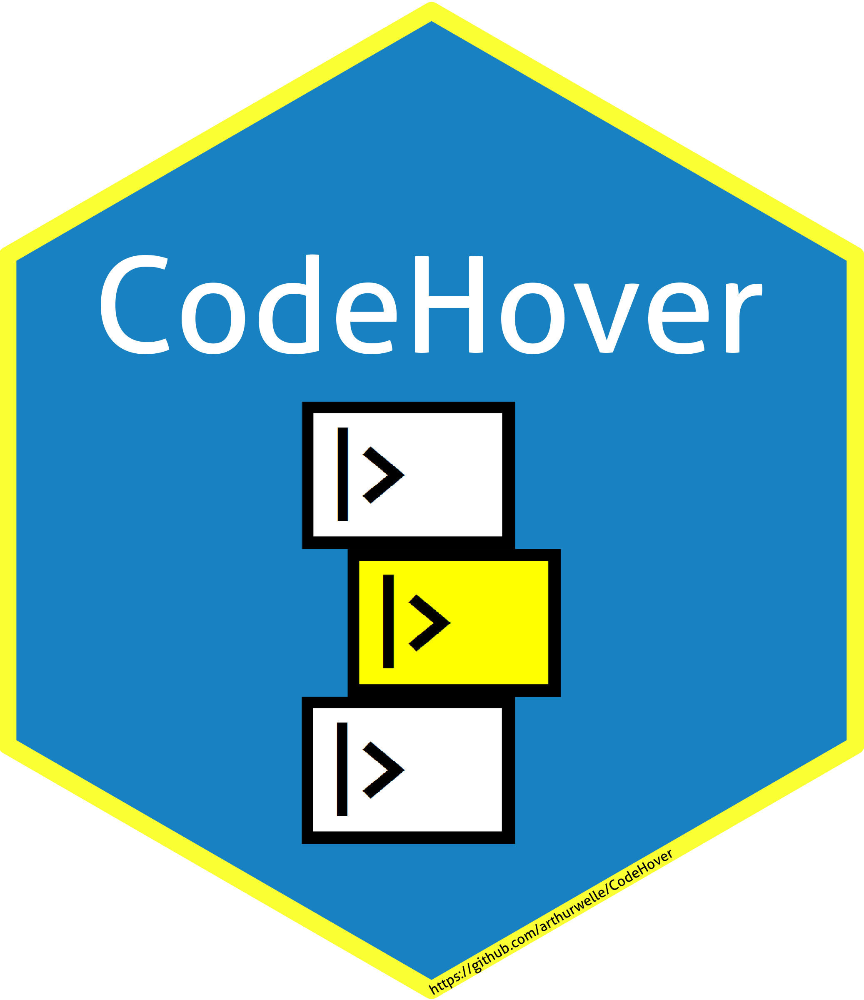
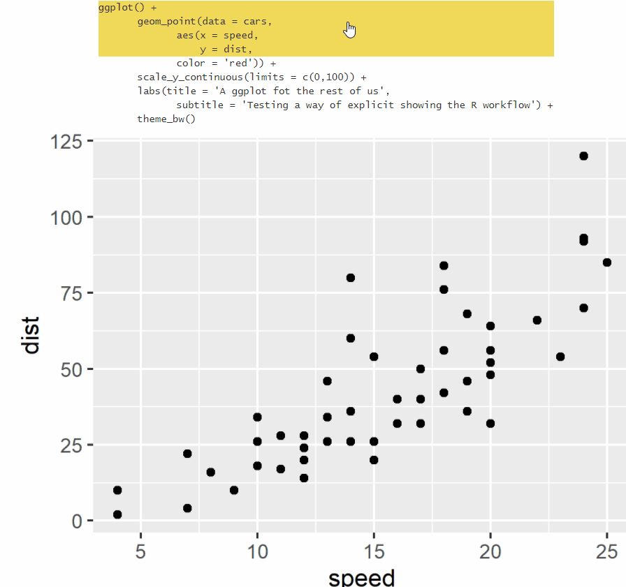
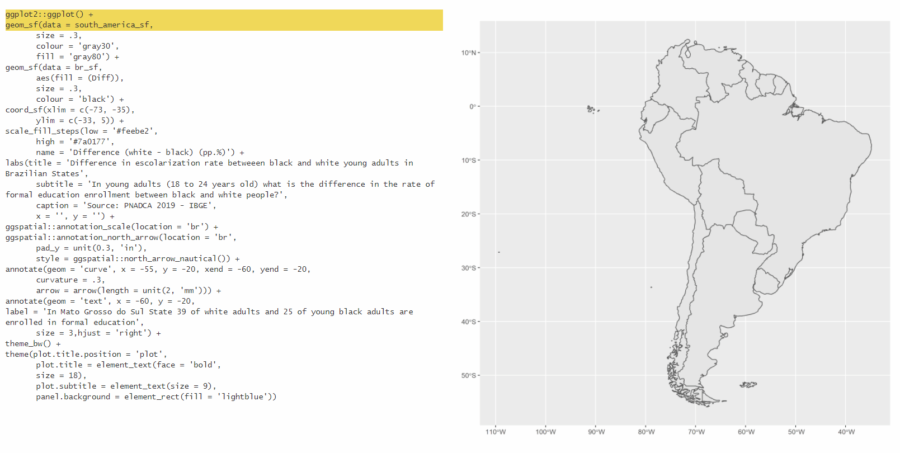

# codehover 

<!-- badges: start -->
<!-- badges: end -->

codehover creates interactive HTML tables where each row is a step of
code and hovering a row shows the corresponding image. It is an
educational tool: a fast way of showing what each line of a ggplot (or
any pipe-like code) actually does.



See a
<a href="https://arthurwelle.github.io/codehover/articles/codehover_intro.html">live
HTML version here</a>.

## Installation

You can install codehover from github:

``` r
install.packages("devtools")
devtools::install_github("arthurwelle/codehover")
```

## Quick start: automatic mode

Since version 1.0.0 you no longer need to save each image by hand, nor
set up any CSS/JavaScript. Give `ch_hover()` your ggplot code and it
does the rest: the code is split at every top-level `+`, each partial
plot is rendered to an image, and the result is a self-contained HTML
object that works in R Markdown, Quarto and the RStudio viewer.

``` r
library(ggplot2)
library(codehover)

ch_hover({
  ggplot(mtcars, aes(x = wt, y = mpg)) +
    geom_point(color = "red") +
    scale_y_continuous(limits = c(0, 40)) +
    labs(title = "A ggplot for the rest of us") +
    theme_bw()
})
```

That single call replaces the whole manual workflow of v1 (saving six
images with `ggsave()`, writing six `ch_row()` calls with hand-made
pseudo-code, and wiring CSS and JavaScript through an R Markdown
template).

### Options worth knowing

``` r
ch_hover({ ... },
  type = "incremental",   # or "one_row": highlight only the hovered row
  layout = "auto",        # image beside the code when there is room,
                          # below it otherwise. "row" forces side by side
                          # (image shrinks if needed); "column" forces
                          # the image below the code
  fixed_scales = FALSE,   # TRUE pins axes/legends from the final plot,
                          # so the image does not "jump" between steps
  width = 7, height = 5,  # image size in inches
  dpi = 96,
  path = NULL             # default: images embedded as base64 and deleted.
)                         # give a folder ("assets/") to keep the PNGs on
                          # disk and reference them by path (smaller HTML)
```

By default each step shows the *true* output of its partial code, so
axes and legends may change as layers are added — pedagogically honest.
Use `fixed_scales = TRUE` for a visually stable reveal (this mechanism
is borrowed from the excellent
<a href="https://github.com/weverthonmachado/ggreveal">ggreveal</a>
package by Weverthon Machado).

### Keeping the source document clean

In R Markdown or Quarto you may prefer to write the plot in a normal
chunk and reference it by label, so your document shows clean code:


    ``` r
    ggplot(mtcars, aes(x = wt, y = mpg)) +
      geom_point() +
      geom_smooth(method = "lm")
    ```

    `r ch_hover_chunk('myplot')`

## Manual mode (low-level API)

The original building blocks are still exported, and they remain the way
to go when your steps are *not* a single ggplot `+` chain:
data-wrangling pipelines, maps built from several objects, any sequence
of images with any pseudo-code.

You build the table by piping three functions — `ch_int()` starts it,
`ch_row()` adds one row linked to one image, `ch_out()` closes it:

``` r
library(magrittr)

result <- ch_int(type = "incremental") %>%
  ch_row(text = "ggplot() + <br> <tab1> geom_point(data = cars, aes(speed, dist)) </tab1>",
         img = "./IMG/1.png") %>%
  ch_row(text = "<tab1> scale_y_continuous(limits = c(0,100)) + </tab1>",
         img = "./IMG/2.png") %>%
  ch_row(text = "<tab1> theme_bw() </tab1>",
         img = "./IMG/3.png") %>%
  ch_out(img = "./IMG/3.png")

result
```

Since v1.0.0 `ch_out()` already returns a renderable object with the CSS
and JavaScript attached — you no longer pass it through
`htmltools::HTML()`, and no template is needed.

Inside `text` you can use `<br>` for line breaks,
`&nbsp;`/`&ensp;`/`&emsp;` for spaces, and the tags `<tab1>` … `<tab16>`
for indentation levels. By default images are embedded into the HTML as
base64 (self-contained single file); pass `url = TRUE` to reference
images hosted elsewhere.

## An example with maps



See the
<a href="https://arthurwelle.github.io/codehover/articles/codehover_map_example.html">HTML
version here</a>.

## What changed in 1.0.0

-   New: `ch_hover()` and `ch_hover_chunk()` — automatic splitting,
    rendering and assembling, now the main entry point.
-   Output is self-contained: CSS and vanilla JavaScript travel with the
    HTML object (`htmltools` dependency). No more templates, YAML
    wiring, or jQuery/CDN.
-   `ch_out()` returns the finished, renderable object directly (do not
    wrap it in `htmltools::HTML()` anymore).
-   Rows now use the valid HTML5 `data-link` attribute (also fixes
    Quarto reveal.js usage); the fixed `id='img_holder'` is gone, so
    several tables can live on one page.
-   Removed: the flipbookr-based functions (`chunk_code_hover()` etc.)
    and the flipbookr dependency. `ch_hover()` replaces them with no
    private-API usage and no `#<<` markers.

## Credits

I began this package without knowing about the similar (and more
sophisticated)
<a href="https://github.com/EvaMaeRey/flipbookr">flipbookr</a> by Gina
Reynolds, based on
<a href="https://github.com/yihui/xaringan">Xaringan</a> — it was
probably in my subconscious all along. codehover v1’s automatic mode was
built on flipbookr internals; v2 has its own splitter but the idea
remains hers. The `fixed_scales` mechanism comes from
<a href="https://github.com/weverthonmachado/ggreveal">ggreveal</a> by
Weverthon Machado.

The codehover hex sticker was made using the R package
<a href="https://github.com/GuangchuangYu/hexSticker">hexSticker</a>.
